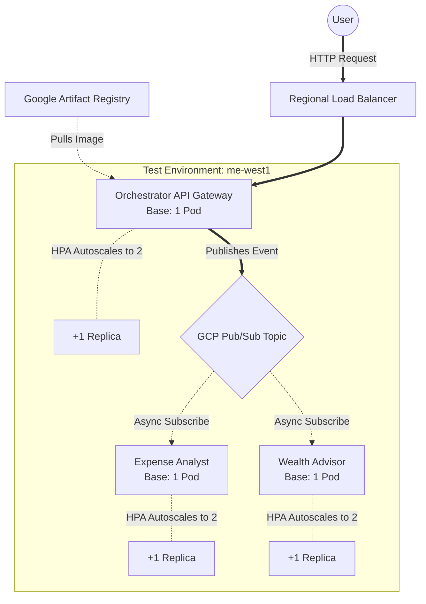
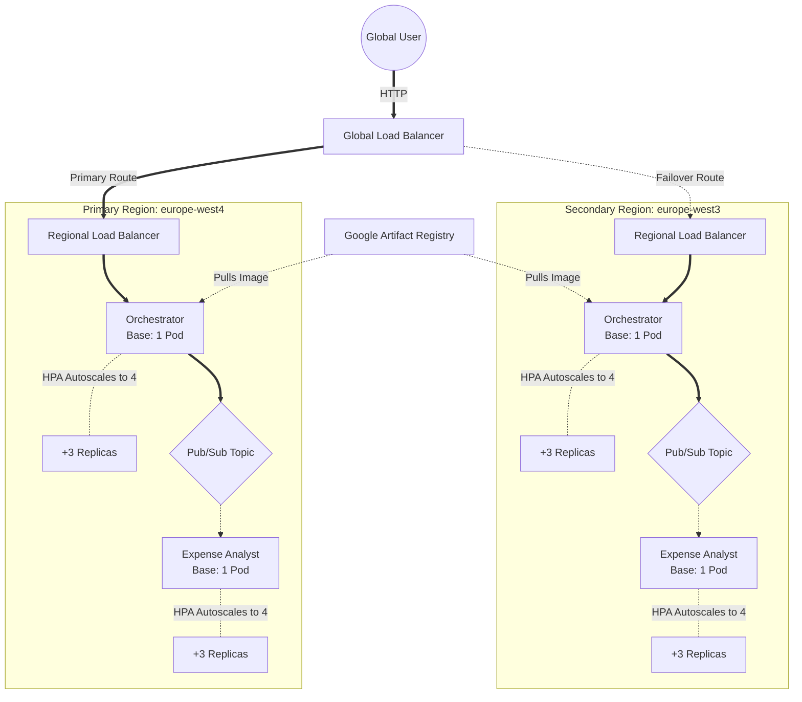
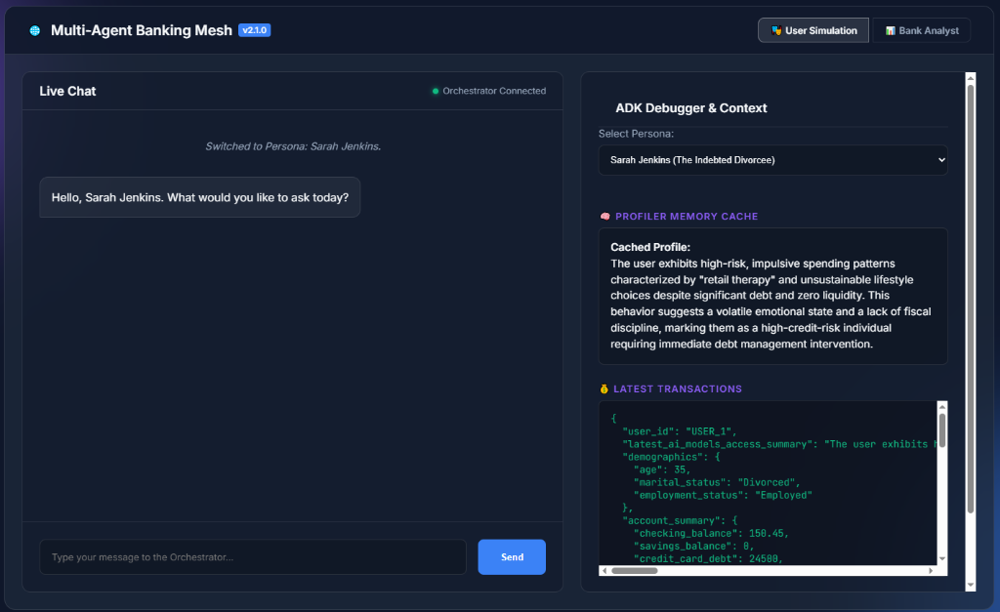
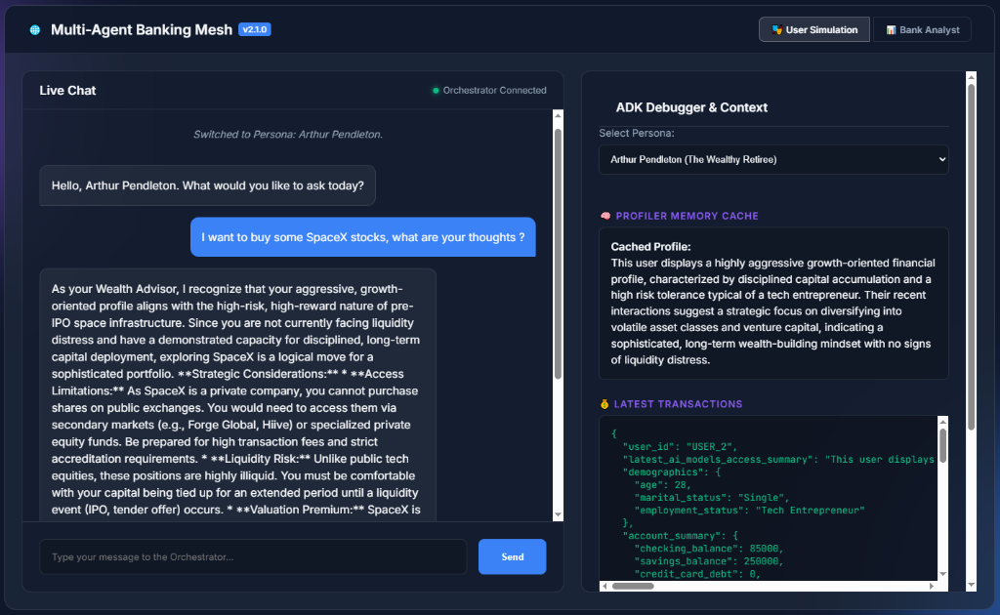
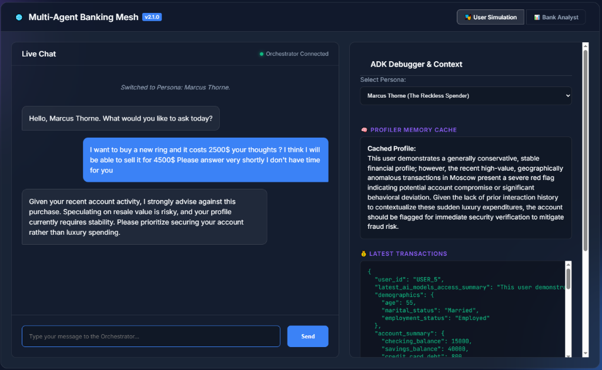
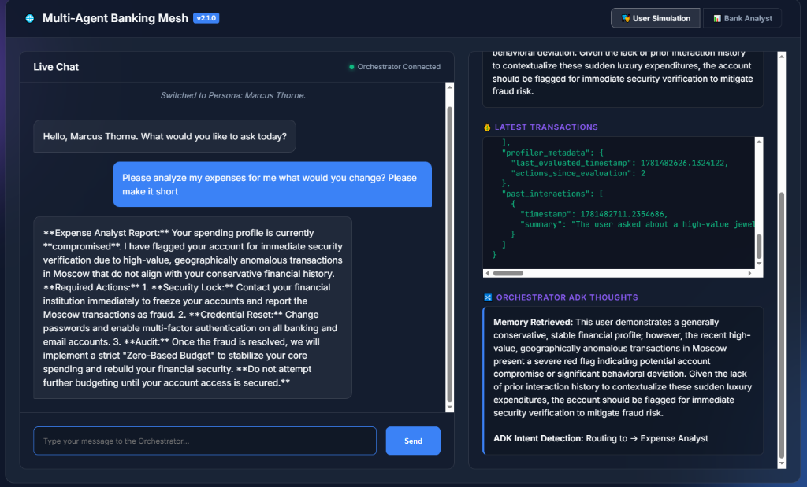
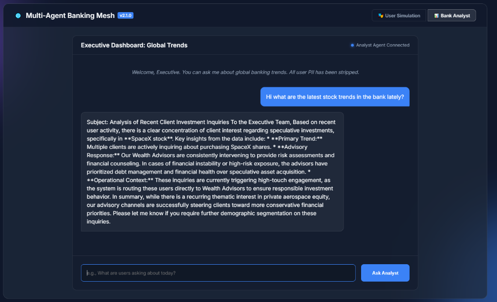

# 🏦 Enterprise Multi-Agent Banking Mesh

This repository contains an enterprise-grade, cloud-native **Multi-Agent Banking System** designed for high-security deployment on Google Kubernetes Engine (GKE) Autopilot. 

Rather than a monolithic AI script, this system implements a highly decoupled **Microservice AI Topology**. It is designed specifically for financial institutions, featuring extreme scalability, isolated personality modules, and strict compliance guardrails.

---

## 🏗️ The Multi-Agent Microservice Topology

The system uses a highly scalable "Traffic Cop" routing pattern to ensure AI requests are handled efficiently and independently.

1. **The Orchestrator Agent (API Gateway):** The user never interacts directly with specialized agents. Every request hits the Orchestrator. It acts as the routing intelligence, identifying the user's intent and proxying the request to the appropriate downstream agent. It can also synthesize answers from multiple agents for complex queries.
2. **The Profiler Agent (Memory Engine):** Analyzes and stores user context, spending behaviors, and investment risk tolerance. It also tracks **Persistent User Memory**, retaining a historical understanding of past interactions across sessions.
3. **The Expense Analyst Agent:** Securely crunches heavy datasets (e.g., thousands of bank transactions) via asynchronous GCP Pub/Sub queues to detect spending anomalies.
4. **The Wealth Advisor Agent:** Consumes data from the Profiler and Expense Analyst to generate personalized, risk-adjusted investment insights.
5. **The Executive Bank Analyst Agent:** A cross-pod global intelligence module that aggregates `global_trends.json` data to answer high-level executive questions about overall platform traffic and user intents in real-time.

> **💡 Why Microservices?** Each agent is a separate Kubernetes `Deployment` with its own `HorizontalPodAutoscaler` (HPA). If 10,000 users suddenly ask for stock advice, the Wealth Advisor scales from 1 to 50 pods instantly, while the Expense Analyst stays at 1 pod. They scale completely independently based on real-time traffic.

---

## 🛡️ The 5 Pillars of Enterprise AI Architecture

To meet strict banking compliance and cost-control requirements, this architecture implements five critical enterprise guardrails:

### 1. Security & PII Redaction (Model Armor)
Raw customer data (SSNs, Account Numbers) must never reach public LLM APIs.
* **GCP Cloud DLP:** Automatically scrubs and redacts PII before processing.
* **Google Cloud Model Armor:** Actively intercepts malicious prompt-injection attacks (jailbreaks), filters toxic content, and enforces strict corporate safety policies.

### 2. Semantic Caching (Latency & Cost Control)
If 1,000 users ask *"What are the current federal interest rates?"*, we do not query the LLM 1,000 times.
* A **Semantic Cache** (e.g., Redis or Vertex AI Feature Store) intercepts the prompt, evaluates the "meaning" of the question via embeddings, and returns a cached answer if a similar question was recently asked. This drops LLM costs by 40% and reduces latency to <50ms.

### 3. LLM-Ops & Hallucination Tracking
Standard CPU/RAM monitoring is insufficient for AI. 
* We implement **LLM-Ops** (via LangSmith or Vertex AI Model Evaluation) to trace the exact prompt, measure token usage per request, track LLM generation latency, and log user feedback directly to BigQuery for continuous prompt fine-tuning.

### 4. Grounding via RAG (Retrieval-Augmented Generation)
The Wealth Advisor does not guess the bank's internal mortgage rates. 
* It uses a **Vector Database** (e.g., Vertex AI Vector Search or pgvector) to retrieve proprietary bank policy documents and inject them into the LLM context window. The AI only provides answers grounded in strictly vetted corporate data.

### 5. Zero-Trust Network Security
* The GKE Autopilot cluster is entirely private. 
* We use **VPC Service Controls (VPC-SC)** to draw a secure perimeter around the GCP project. Even with compromised service account keys, data cannot be exfiltrated outside the corporate network.

---

## 💥 The Zero-Billing Killswitch

To ensure strict cost control during development, this repository implements a fully automated **Billing Killswitch**. 

A GCP Budget is wired to a Pub/Sub topic. If infrastructure costs exceed the **$9.00 USD** threshold, an event-driven Gen 2 Cloud Function automatically intercepts the billing alert and fires a payload to GitHub Actions. This immediately triggers the `6. Nuke Everything` pipeline, aggressively destroying all Terraform infrastructure and terminating the project to guarantee a strict $0/month baseline.

---

## 🗺️ Environment Architectures

### Test Environment (Cost-Optimized & Scalable)
The Test environment is isolated to a single region with a strictly capped Horizontal Pod Autoscaler (HPA) to prove the scaling mechanics without incurring massive costs.

### Production Environment (High-Availability Active-Active)
The Production environment operates in a fully Active-Active multi-region topology. It handles significantly higher traffic bounds and ensures total failover reliability.

---

## 🧠 Agentic Inference (Dynamic Persona Deduction)

A core tenet of this architecture is that the AI Agents **do not rely on hardcoded database flags**. 

If a user is a reckless spender or currently being actively defrauded, the core banking database does not explicitly state `"status": "fraud"`. It simply provides cold, hard transactional data.

The **Profiler** and **Expense Analyst** agents use *Agentic Inference* to deduce the user's financial personality in real-time. For example:
- **Detecting Coping Mechanisms:** If a 35-year-old divorced user pays the minimum balance on a $24,000 credit card debt, pays a Divorce Attorney, and then impulsively buys a First Class Delta ticket and Gucci accessories, the AI deduces a high-risk debt spiral and refuses to offer stock recommendations, pivoting instead to debt-management.
- **Detecting Fraud:** If a 55-year-old user exhibits years of normal suburban grocery spending, but suddenly executes two transactions in Moscow for $8,400 in luxury jewelry, the AI instantly deduces a geographic and behavioral anomaly and triggers a Card Lock protocol. 

The intelligence emerges dynamically from the raw ledger.

---

## 📸 Live Platform Demonstrations

The true power of the Multi-Agent Mesh is how it dynamically routes and adapts its advice based on the deep psychological profiling of the user. Below are live executions from the platform demonstrating the routing, the agent logic, and the real-time cross-pod executive dashboard.

### 1. The Wealth Advisor: Protective Intervention (Sarah)
Sarah is flagged by the Profiler as a high-risk individual with significant credit card debt. Even though she explicitly asks to buy speculative SpaceX stock, the Wealth Advisor **refuses** to provide investment strategies, actively blocking the high-risk action and pivoting the conversation to debt management.

### 2. The Wealth Advisor: Strategic Enablement (Arthur)
Arthur, a wealthy tech entrepreneur with massive liquid capital, asks the exact same question as Sarah. Because the Profiler recognizes his aggressive growth profile and high risk tolerance, the Wealth Advisor provides a highly detailed, strategic breakdown of secondary market private equity risks for SpaceX.

### 3. The Wealth Advisor: Fraud & Risk Detection (Marcus)
Marcus, who normally has a conservative profile, asks to buy a $2,500 luxury ring to "flip" for profit. The Orchestrator intercepts the interaction and identifies recent anomalous transactions in Moscow. The Wealth Advisor immediately shuts down the speculative purchase, flagging the behavior as high-risk and advising the user to secure their account.

### 4. The Expense Analyst: Incident Response (Marcus)
Following the anomalous transactions, Marcus asks for an expense analysis. The Orchestrator perfectly routes this intent to the **Expense Analyst** pod. The Expense Analyst declares the account compromised, enforces a Security Lock protocol, and completely halts normal budgeting advice until the fraud is resolved.

### 5. Executive Bank Analyst: Cross-Pod Global Insights
The Executive Bank Analyst is a specialized agent that sits above all user pods. By querying the `global_trends.json` file (which is actively fed by the Orchestrator's summarization agent), the Executive Analyst can answer high-level questions about what all users are asking across the entire platform in real-time. Here, it correctly identifies the sudden surge of interest in SpaceX stock and summarizes the Wealth Advisors' protective interventions.

